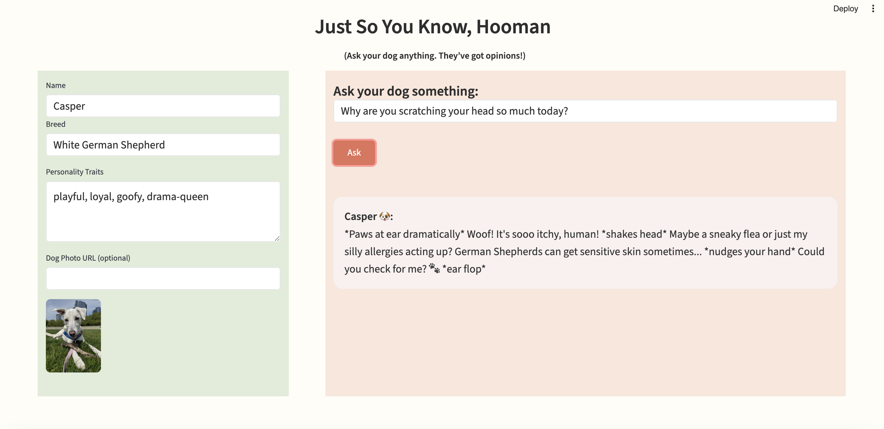

# Just So You Know, Human

**Just So You Know, Human** is a whimsical GenAI chatbot that lets you talk to your dog — and hear what they might say back.  
Built with ❤️ using Streamlit and OpenRouter, it's the perfect blend of imagination and GenAI.

---

## Features

- Talk to your dog by name, breed, and personality
- Upload a photo or use the default White German Shepherd
- Beautifully styled with sage and terracotta cards
- Receive GenAI-powered dog responses with personality
- Built with Streamlit, styled for web and mobile

---

## Preview

 <!-- Replace this with your actual screenshot filename -->

---

## 🚀 Run the App

### 1. Clone the Repo

```bash
git clone https://github.com/shrutirai-lgtm/just-so-you-know-human.git
cd just-so-you-know-human
```

### 2. Set up Environment

```bash
python3 -m venv venv
source venv/bin/activate
pip install -r requirements.txt
```

### 3. Add your OpenRouter API key

Create a .env file:

```env
OPENROUTER_API_KEY=your-api-key-here
```

### 4. Run Streamlit

```bash
streamlit run app.py
```

## 👋 Author
Built by Shruti Rai
Design, code, and a whole lot of dog energy. 🐾